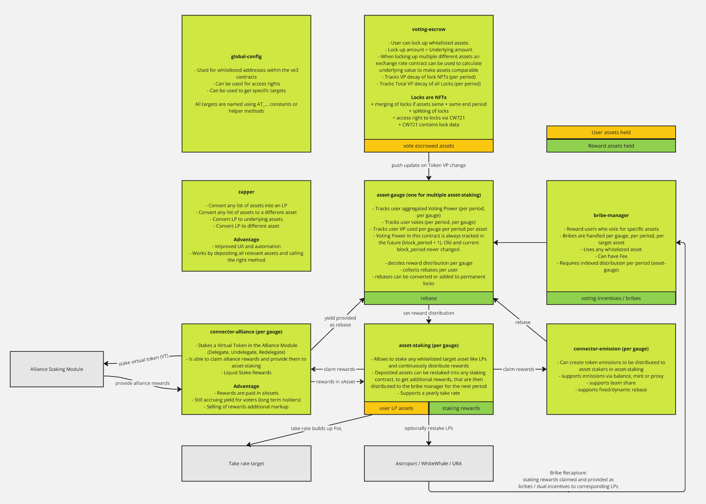

# ve(3,3)

This repository contains the contracts for the Terra Liquidity Alliance. They implement a ve3 model to decide on chain rewards going to staked LPs. It has the following features:

- Allow locking of multiple tokens for voting power (voting-escrow)
- Locks have the properties of NFTs and can also be merged or split apart for better management (voting-escrow)
- Rebase rewards can be distributed to lockers (asset-gauge)
- Allow voting based on a users VP on multiple group of assets (asset-gauge)
- Bribe Market to incentivize voting behavior (bribe-market)
- Global configuration of addresses and rights (global-config)
- Allow creation of a virtual token and staking it in Alliance Module (connector-alliance)
- Allow staking of whitelisted assets, claiming rewards, with a take rate (asset-staking)
- Allow conversion of any list of assets to a different asset or LP (zapper)

## Notice

This repository contains software developed by:

- Enterprise Protocol V1.1.0 (Apache 2.0) <https://github.com/terra-money/enterprise-contracts/tree/version/1.1.0?tab=License-1-ov-file>

- Alliance Protocol (Apache 2.0) <https://github.com/terra-money/alliance-protocol/>

- White Whale Modifications on Alliance Protocol (Apache 2.0) <https://github.com/White-Whale-Defi-Platform/cw-alliance-hub>

- Mars Address Provider (GPL 3) <https://github.com/mars-protocol/contracts/blob/master/contracts/address-provider/src/contract.rs>

- Astroport Voting Escrow (GPL 3) <https://github.com/astroport-fi/astroport-governance>

- ERIS Protocol (GPL 3) <https://github.com/erisprotocol/contracts-terra>
